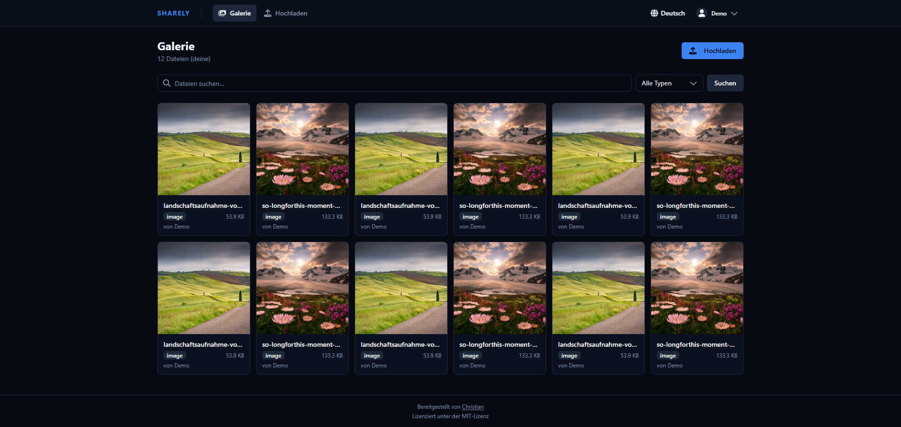
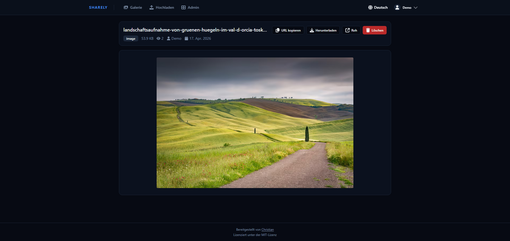
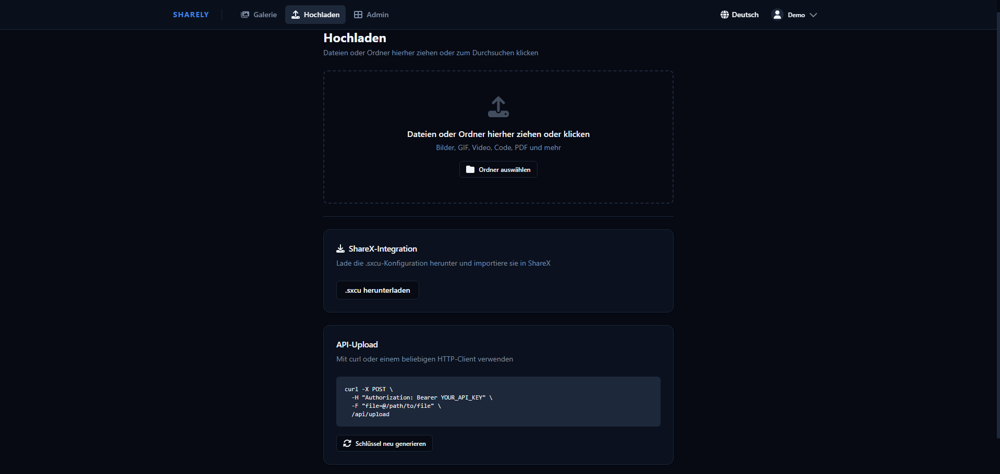
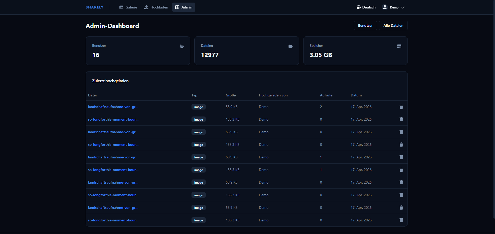
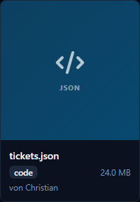

<p align="center">
  
</p>

<p align="center">
  <a href="https://sharely.christian.pizza/docs"><strong>📖 Documentation →</strong></a>
</p>

A self-hosted file sharing platform with a clean web interface, ShareX integration, and API access. Upload screenshots, files, and media — then instantly share them via short links.



## Features

- **Web UI** — Drag-and-drop uploads, searchable gallery with type filters (images, video, audio, PDF, code), fully mobile-responsive
- **Chunked uploads** — Files up to 2 GB supported via parallel multi-part chunked upload (automatic, no client config needed)
- **ShareX integration** — One-click `.sxcu` config download for automatic screenshot uploads from Windows
- **API uploads** — Bearer token authentication, compatible with curl, wget, and any HTTP client
- **File viewing** — Images zoom inline, videos/audio stream with seek support (HTTP Range), PDFs render in-browser, code files syntax-highlighted
- **File download** — Force-download endpoint (`/f/<id>/download`) separate from the inline viewer
- **Embed modes** — Per-user toggle between *embed* (rich HTML page with Open Graph / Twitter Card metadata) and *raw* (direct file redirect for native social embeds); social media bots (Discord, Telegram, Twitter, etc.) are detected automatically
- **Share links** — Generate per-file share links (`/s/<token>`) with optional password protection, expiry date, and download limit
- **Collections** — Group files into named collections with optional password and expiry date, shareable via a single link
- **Tags** — Tag files for organisation; define a personal set of predefined tags in Settings for quick reuse
- **Thumbnails** — Video and PDF files get auto-generated JPEG thumbnails (requires ffmpeg / ghostscript, bundled in the Docker image)
- **Avatars** — Users can upload a profile avatar (JPEG, PNG, GIF, WebP, max 2 MB)
- **Internationalization** — UI and email templates available in 8 languages: English, Deutsch, Français, Español, Italiano, Português, 日本語, 中文
- **Email verification & password reset** — Requires SMTP configuration; tokens expire after 24 h (verification) / 1 h (reset)
- **User management** — Role-based access control (admin/user), account activation/deactivation, custom folder names
- **Admin dashboard** — Stats overview, manage all users and files, audit log with CSV export
- **Real-time UI** — WebSocket-powered live updates: file view counters, gallery refresh on upload/delete, admin stats and audit log stream in real time
- **XBackBone migration** — Import your existing XBackBone installation including files and metadata
- **Short links** — Every file gets an 8-character short ID (e.g. `/f/a1b2c3d4`)
- **Delete tokens** — Each file carries a unique deletion token so ShareX (or any client) can delete files without a session
- **Security** — Dangerous file types (`.exe`, `.bat`, `.sh`, `.php`, `.ps1`, …) are blocked on upload; rate limiting on uploads and authentication endpoints
- **Docker-ready** — Single `docker compose up` gets you running
- **GDPR-ready** — Privacy policy & Terms of Service pages (configurable), data export (Art. 20), account deletion (Art. 17), audit log with 90-day auto-expiry, configurable file retention, API key hashing, and optional Cloudflare Analytics cookie consent out of the box

### Screenshots

| Gallery | File View |
|---|---|
|  |  |

| Upload | Admin Dashboard |
|---|---|
|  |  |

## Quick Start

### Docker (recommended)

**Requirements:** Docker and Docker Compose

```bash
git clone https://github.com/Christianoooooo/sharely.git
cd sharely
cp .env.example .env
```

Edit `.env` with your settings (see [Configuration](#configuration)), then:

```bash
docker compose up -d
```

The app is now running at `http://localhost:3000`. Register the first account — it will automatically be an admin.

### Local Development

**Requirements:** Node.js 18+, MongoDB

```bash
# Backend
npm install
npm run dev

# Frontend (separate terminal)
cd client
npm install
npm run dev
```

- Backend: `http://localhost:3000`
- Frontend dev server: `http://localhost:5173`

## Configuration

Copy `.env.example` to `.env` and adjust the values:

| Variable | Default | Description |
|---|---|---|
| `PORT` | `3000` | Port the server listens on |
| `MONGO_ROOT_PASSWORD` | — | MongoDB root password (required) |
| `MONGO_APP_USER` | `appuser` | MongoDB application user |
| `MONGO_APP_PASSWORD` | — | MongoDB application user password (required) |
| `MONGO_DB_NAME` | `sharely` | MongoDB database name |
| `SESSION_SECRET` | — | Secret for session encryption — use a long random string (required) |
| `BASE_URL` | `http://localhost:3000` | Public base URL for generated share links, no trailing slash |
| `SITE_NAME` | `sharely` | Site name shown in Open Graph embeds |
| `MAX_FILE_SIZE_MB` | `100` | Maximum upload file size in MB (chunked uploads can go up to 2 GB regardless) |
| `ALLOW_REGISTRATION` | `true` | Set to `false` to disable public sign-up (admin-only user creation) |
| `SMTP_HOST` | — | SMTP server hostname; leave blank to disable email features |
| `SMTP_PORT` | `587` | SMTP port |
| `SMTP_SECURE` | `false` | `true` for implicit TLS (port 465), `false` for STARTTLS (port 587) |
| `SMTP_USER` | — | SMTP authentication username |
| `SMTP_PASS` | — | SMTP authentication password |
| `SMTP_FROM` | _(SMTP_USER)_ | From address shown in outgoing emails |

Generate a secure session secret:

```bash
openssl rand -hex 32
```

### SMTP / Email

When `SMTP_HOST` is set, sharely enables:

- **Email verification** — new accounts must verify their address before logging in; tokens expire after 24 hours
- **Email change confirmation** — a verification link is sent to the new address
- **Password reset** — "Forgot password" flow with a 1-hour reset token (rate-limited to 5 requests per hour)

Email subjects and body copy are translated into all 8 supported languages and sent in the user's chosen language.

If `SMTP_HOST` is left blank, all email-dependent features are hidden from the UI and registration proceeds without verification.

## API Usage

Get your API key from **Settings → API Key** in the web UI.

**Upload a file:**

```bash
curl -X POST https://your-domain.com/api/upload \
  -H "Authorization: Bearer YOUR_API_KEY" \
  -F "sharex=@/path/to/file.png"
```

The response contains the URL to the uploaded file and a `deletionUrl` that can be used to delete the file without a session (used automatically by ShareX).

**Delete a file:**

```bash
curl -X DELETE https://your-domain.com/api/delete/SHORT_ID \
  -H "Authorization: Bearer YOUR_API_KEY"
```

**List your files:**

```bash
curl https://your-domain.com/api/gallery \
  -H "Authorization: Bearer YOUR_API_KEY"
```

### Chunked Uploads

For large files the web UI automatically switches to chunked upload mode (files above ~250 MB). Chunks of 10–20 MB are uploaded in parallel (3–5 concurrent chunks). The API also exposes the chunked upload endpoints for programmatic use — see `/api/upload/chunk/init`, `/api/upload/chunk/:sessionId`, and `/api/upload/chunk/:sessionId/finalize`.

## ShareX Setup

1. Log in and go to **Upload**
2. Click **Download ShareX Config**
3. Open the downloaded `.sxcu` file — ShareX will import it automatically
4. Screenshots and uploads are now sent directly to your instance

ShareX receives a `deletionUrl` in the upload response and can delete files without re-authenticating.

## Share Links

Any file can have one or more share links generated from the file view. Each link is served at `/s/<token>` and supports:

- **Password protection** — visitors must enter a password before accessing the file
- **Expiry date** — the link becomes invalid after the configured date
- **Download limit** — the link is disabled after N downloads (-1 = unlimited)

Share links are independent of the owner's account. Deleting a share link does not delete the underlying file.

## Collections

Collections group multiple files under a single shareable link. Create and manage them from the **Collections** page. Each collection supports:

- Custom name and description
- Optional password and expiry date
- Adding / removing individual files

Collections are served at `/c/<shortId>` and respect the same password/expiry rules as share links.

## Tags

Files can be tagged for organisation and filtering. Tags are stored per file and are searchable in the gallery.

To speed up tagging, define a personal list of **predefined tags** under **Settings → Preferences → Tag Management**. These appear as one-click suggestions when tagging files.

## WebSocket API

The app maintains a persistent WebSocket connection (`/ws`) for all authenticated clients. The protocol uses a request/response pattern plus server-initiated broadcasts.

**Request format** (client → server):
```json
{ "id": "unique-request-id", "action": "action:name", "payload": {} }
```

**Response format** (server → client):
```json
{ "id": "unique-request-id", "data": {}, "error": null }
```

**Broadcast format** (server → relevant clients):
```json
{ "event": "event:name", "data": {} }
```

### Available Actions

| Action | Auth | Description |
|---|---|---|
| `site-settings:get` | — | Public site settings |
| `auth:me` | User | Current session user |
| `file:get` | User | File details (increments view count) |
| `file:list` | User | Own files (admins see all) |
| `file:delete` | User | Delete a file |
| `user:get-key` | User | API key prefix |
| `user:regen-key` | User | Regenerate API key |
| `user:change-password` | User | Change password |
| `user:change-username` | User | Change username |
| `user:change-email` | User | Change email (sends verification) |
| `user:change-language` | User | Set UI language |
| `user:change-embed-mode` | User | Toggle embed / raw mode |
| `user:resend-verification` | User | Re-send verification email |
| `user:export` | User | Export account data as JSON |
| `user:delete-account` | User | Delete account and all files |
| `admin:stats` | Admin | Dashboard statistics |
| `admin:settings:get` | Admin | Read site settings |
| `admin:settings:update` | Admin | Update site settings |
| `admin:users:list` | Admin | List all users |
| `admin:users:create` | Admin | Create user |
| `admin:users:toggle` | Admin | Activate / deactivate user |
| `admin:users:role` | Admin | Change user role |
| `admin:users:delete` | Admin | Delete user |
| `admin:users:regen-key` | Admin | Regenerate a user's API key |
| `admin:users:password` | Admin | Set a user's password |
| `admin:users:folder` | Admin | Change a user's folder name |
| `admin:files:list` | Admin | List all files |
| `admin:audit-log:list` | Admin | Paginated audit log |

### Broadcast Events

| Event | Recipients | Payload |
|---|---|---|
| `file:uploaded` | Uploader only | `{ shortId, uploaderId }` |
| `file:deleted` | Owner only | `{ shortId, uploaderId }` |
| `file:view` | All clients | `{ shortId, views }` |
| `user:created` | Admins | `{ id, username, role }` |
| `user:deleted` | Admins | `{ id }` |
| `user:updated` | Admins | `{ id, …changed fields }` |
| `audit:log` | Admins | Full AuditLog object |
| `settings:updated` | Admins | Updated SiteSettings object |
| `stats:invalidate` | Admins | `{}` (trigger a stats re-fetch) |

## Reverse Proxy (Nginx example)

WebSocket support requires the `Upgrade` and `Connection` headers to be forwarded:

```nginx
server {
    listen 443 ssl;
    server_name files.example.com;

    client_max_body_size 2100M;

    location / {
        proxy_pass http://localhost:3000;
        proxy_set_header Host $host;
        proxy_set_header X-Real-IP $remote_addr;
        proxy_set_header X-Forwarded-For $proxy_add_x_forwarded_for;
        proxy_set_header X-Forwarded-Proto $scheme;

        # WebSocket support
        proxy_http_version 1.1;
        proxy_set_header Upgrade $http_upgrade;
        proxy_set_header Connection "upgrade";
    }
}
```

Make sure `BASE_URL` in `.env` matches your public domain.

> **Note on `client_max_body_size`:** Set this at least as large as your largest expected chunked segment plus some headroom. For 2 GB file support, `2100M` is a safe value.

## Thumbnails

Video and PDF files get a JPEG thumbnail automatically on upload. Thumbnails are stored in `uploads/.thumbnails/` and served at `/f/<shortId>/thumb`.



The Docker image includes `ffmpeg` (video) and `ghostscript` (PDF), so no extra setup is needed there. For local development, install the tools manually:

```bash
# Debian / Ubuntu
sudo apt install ffmpeg ghostscript

# macOS
brew install ffmpeg ghostscript
```

If the tools are unavailable, thumbnail generation is silently skipped and the gallery shows a styled colour-coded placeholder instead.

### Backfilling existing uploads

To generate thumbnails for files that were uploaded before this feature was introduced, run the migration script once inside the container:

```bash
docker exec -it <container-name> npm run migrate:thumbnails
```

Or locally:

```bash
npm run migrate:thumbnails
```

The script is idempotent — already-generated thumbnails are skipped.

## XBackBone Migration

If you're migrating from [XBackBone](https://github.com/SergiX44/XBackBone):

1. Log in as admin and go to **Admin → Import**
2. Provide the path to your XBackBone `database.db` file
3. Provide the path to your XBackBone `storage/` directory
4. Run a preview first, then confirm the import

Users are matched by username. Files without a matching user are assigned to a fallback user you specify. The import handles multiple XBackBone schema versions and searches storage subdirectories automatically. It is idempotent — re-running it skips already-imported files.

## End-to-End Tests

The project ships with a [Playwright](https://playwright.dev/) test suite covering the main user flows (upload, gallery, share links, tags, admin actions).

**Run tests (requires the app to be running):**

```bash
# Headless
npm run test:e2e

# Interactive UI mode
npm run test:e2e:ui
```

The global setup in `e2e/global-setup.js` creates the necessary test users automatically. Make sure `BASE_URL` in `.env` points to a running instance before executing the suite.

## Project Structure

```
sharely/
├── app.js                  # Express entry point
├── src/
│   ├── config/db.js        # MongoDB connection
│   ├── models/             # Mongoose schemas (User, File, Collection, ShareLink, AuditLog, SiteSettings)
│   ├── middleware/         # Auth, upload handling, file block list
│   ├── jobs/
│   │   └── retentionCleanup.js   # Scheduled file & audit log cleanup
│   ├── utils/
│   │   ├── generateThumbnail.js  # ffmpeg/ghostscript thumbnail generation
│   │   └── mailer.js             # Nodemailer wrapper with i18n templates
│   ├── ws.js               # WebSocket server (all WS actions & broadcasts)
│   └── routes/             # REST routes (auth, api, files, shares, collections, import, install)
├── client/                 # React frontend (Vite + Tailwind)
│   └── src/
│       ├── i18n/           # i18next config + 8 locale JSON files
│       ├── hooks/
│       │   └── useWebSocket.js   # React hook for WS connection & events
│       ├── pages/          # Upload, Gallery, FileView, Collections, Settings, Admin pages
│       └── components/     # UI components
├── e2e/                    # Playwright end-to-end tests
├── scripts/
│   ├── setup-db.js
│   ├── migrate-uploads-to-user-folders.js
│   └── generate-missing-thumbnails.js
├── uploads/
│   ├── .thumbnails/        # auto-generated JPEG thumbnails
│   ├── .chunks/            # temporary chunked-upload segments
│   └── .avatars/           # user profile avatars
├── docker-compose.yml
└── .env.example
```

## Tech Stack

| Layer | Technology |
|---|---|
| Backend | Node.js, Express |
| Database | MongoDB (Mongoose) |
| Real-time | WebSocket (`ws`) |
| Email | Nodemailer |
| Frontend | React 18, React Router, Vite |
| Styling | Tailwind CSS, Radix UI |
| i18n | i18next |
| File uploads | Multer (standard) + chunked upload (custom) |
| Auth | express-session, bcryptjs |
| Container | Docker, Docker Compose |

## GDPR / Privacy

Sharely is designed with privacy in mind. The following features support GDPR compliance for operators in the EU:

| Feature | GDPR Article |
|---|---|
| Privacy Policy page (configurable via Admin Panel) | Art. 13/14 – Transparency |
| Terms of Service page (configurable via Admin Panel) | Art. 13/14 – Transparency |
| Data export (JSON download of account + file metadata with full URLs) | Art. 20 – Portability |
| Account self-deletion (removes all files and data) | Art. 17 – Right to erasure |
| Audit log (all access and admin actions, 90-day auto-expiry via MongoDB TTL) | Art. 5(2) – Accountability |
| Audit log CSV export for regulators | Art. 5(2) – Accountability |
| Configurable file retention (auto-delete after N days) | Art. 5(1)(e) – Storage limitation |
| API keys stored as SHA-256 hashes, never in plaintext | Art. 32 – Security |
| Passwords stored as bcrypt hashes (12 rounds) | Art. 32 – Security |
| Encryption-at-rest documentation (operator self-declaration) | Art. 32 – Security |
| Cookie consent notice for Cloudflare Analytics (optional) | Art. 13 – Transparency |

> **Note for operators:** GDPR compliance is ultimately the operator's responsibility. Before going live, fill in your operator details under **Admin → Site Settings** (name, address, contact email). Consider whether you need a Data Processing Agreement (DPA) with your hosting provider.

## License

MIT
